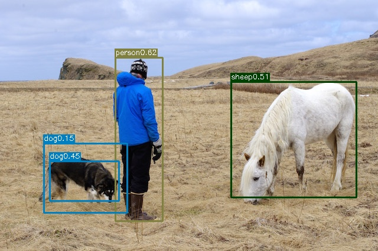

## YOLO: Real-Time Object Detection


<div align='center'>
  
  
</div>

**Train on voc2012+2007**

| Model                | Backbone | mAP@voc2007test  | FPS  |
| -------------------- | -------------- | ---------- | -------   |
| ResNet YOLOv1  |   ResNet50        | 0.49  |  __   |
| YOLOv1  |   darknet19        | 0.634      |  45   |


**Dataset:**
1. Download `voc2012train` [dataset](http://host.robots.ox.ac.uk/pascal/VOC/voc2012/VOCtrainval_11-May-2012.tar)
2. Download `voc2007train` [dataset](http://host.robots.ox.ac.uk/pascal/VOC/voc2007/VOCtrainval_06-Nov-2007.tar)
3. Download `voc2007test` [dataset](http://host.robots.ox.ac.uk/pascal/VOC/voc2007/VOCtest_06-Nov-2007.tar)
4. Put all images in `JPEGImages` folder in `voc2012train` and `voc2007train` to `Images` folder as following:
```
├── Dataset 
    ├── Images
        ├── 0001.jpg
        ├── 0002.jpg
    ├── Labels
        ├── 0001.txt
        ├── 0002.txt
    ├── train.txt
    ├── test.txt
```

Each label consists of class and bounding box information. e.g `0001.txt` : 
```
1 255 247 425 468
0 470 105 680 468
1 152 356 658 754
```
**How to convert `.xml` files to `.txt` format?**
* Download [this repo](https://github.com/yakhyo/YOLO2VOC) and modify `config.py` to convert `VOC` format to `YOLO` format labels


**Train:**
- `python main.py`

**Evaluation:**
- `python eval.py`
- In `evaluation.py`, `im_show=False` change to `True` to see the results.

**Detection:**
 - To show the result image - `python detect.py --image assets/person.jpg`
 - Save result image - `python detect.py --image assets/person.jpg --save_img` 

**Weights:**
- Run the `download.sh` file in `weights` folder or download from this [link](https://www.dropbox.com/sh/nde76eig64rm02p/AADCumUHtwJgzyQeN2VvzBTxa?dl=0)

Result:
```text
CLASS                     AP
aeroplane                 0.54
bicycle                   0.60
bird                      0.48
boat                      0.28
bottle                    0.16
bus                       0.63
car                       0.59
cat                       0.71
chair                     0.24
cow                       0.48
diningtable               0.39
dog                       0.64
horse                     0.58
motorbike                 0.59
person                    0.51
pottedplant               0.17
sheep                     0.47
sofa                      0.50
train                     0.69
tvmonitor                 0.46
mAP: 0.49
```


any questions are welcome... 

**Reference:**
 - https://github.com/abeardear/pytorch-YOLO-v1
